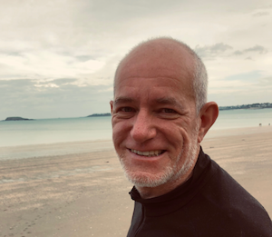

# corsaire hacker ([histoire](./parcours.html))

**Je rêve d'un monde vivant apaisé,**

**cultivant les communs et l'open source.**

**Je m'efforce d'effacer l'impact néfaste des activités humaines.**

**Je vis  la permaculture à petite terre**

# Mes Services

**<mark>Sparring partner</mark>** : J’accompagne les dirigeants dans leur quotidien et dans leur réflexion stratégique afin de les aider à faire les bons choix, sans regret…

Je n’ai pas de conseil à donner, mais je m’engage en donnant mon avis.

**<mark>Créatif innovant</mark>** : Je vous (dé-)montre très rapidement le potentiel de transformation de vos produits et services.

**<mark>Capitaine de Projet</mark>** : Je me mets au service de vos équipes exploratrices d'un monde meilleur et les aide à surmonter les obstacles sur leur chemin.

***

## Un projet en tête ? [Parlons-en !](mailto:nicolas@le.douar.ec)

***

> **Be the change you want to see in the world (Gandhi)**

***
Références :
inspiring innovation - eXtrème Défi - mobizen - VTlib —cityzencar - GOWare - code to vote
